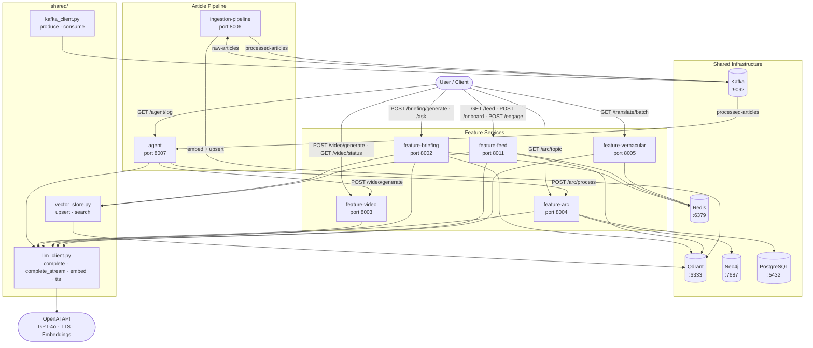

# ET AI News Platform — Architecture

**PS8 submission — ET AI Hackathon 2026**

---

## System Overview

The ET AI News Platform is an AI-native microservices system built for Economic Times, delivering personalisation, multilingual access, intelligent briefings, story tracking, AI-generated video, and autonomous agent processing to ET readers. Seven independently deployable services share a common infrastructure layer (Qdrant, Redis, Neo4j, PostgreSQL, Kafka) and route all LLM calls through a single shared client (`shared/llm_client.py`) backed by the OpenAI API. GPT-4o is the primary intelligence layer across every feature — handling translation, ranking, briefing synthesis, sentiment scoring, video script generation, and autonomous editorial decisions — with OpenAI TTS for audio and `text-embedding-3-small` for semantic search.

---

## Full System Architecture



---

## Service Table

| Service | Port | Key Technologies | Purpose |
|---|---|---|---|
| `ingestion-pipeline` | 8006 | Kafka, Qdrant, text-embedding-3-small | Consumes raw-articles from Kafka, embeds with OpenAI, upserts to Qdrant |
| `agent` | 8007 | GPT-4o, Kafka, REST | Autonomous agent: reads processed articles, decides arc/video actions, dispatches to feature services |
| `feature-vernacular` | 8005 | GPT-4o, Redis (L1+L2 cache) | EN → 8 Indian language translation with financial glossary |
| `feature-feed` | 8011 | Qdrant, Redis, OpenAI Embeddings | Personalised article ranking via semantic similarity + EMA |
| `feature-briefing` | 8002 | Qdrant, Redis, GPT-4o | RAG briefings with RRF retrieval, dedup, SSE streaming, article-context Q&A |
| `feature-arc` | 8004 | spaCy, Neo4j, PostgreSQL, GPT-4o-mini | NER → entity graph → sentiment timeline → AI predictions |
| `feature-video` | 8003 | GPT-4o, OpenAI TTS, FFmpeg, Pillow | Scene manifest → TTS audio → Pillow frames → FFmpeg MP4 |

---

## Data Flow Per Feature

| Feature | Pipeline |
|---|---|
| **Ingestion** | Kafka raw-articles → embed (text-embedding-3-small) → Qdrant upsert → publish processed-articles |
| **Agent** | Kafka processed-articles → GPT-4o decision (arc / video / skip) → POST to feature services |
| **Vernacular** | Article text → chunk (800 tokens) → GPT-4o + glossary injection → quality check → Redis + file cache → translated article |
| **Feed** | User signal → EMA vector update (α=0.15) → Qdrant ANN (top 200) → rerank (cosine + recency + diversity) → top 20 articles |
| **Briefing** | Topic query → RRF merge (semantic + keyword search) → Jaccard dedup (0.60) → GPT-4o → structured JSON + source citations + token-by-token SSE |
| **Arc** | Article → spaCy NER + alias resolution → Neo4j MERGE (Entity + CO_OCCURS) + GPT-4o-mini sentiment → PostgreSQL → GPT-4o predictions |
| **Video** | Article → GPT-4o scene manifest → OpenAI TTS per scene + Pillow PNG frames → FFmpeg concat demuxer → MP4 |

---

## Error Handling

- **`_parse_json()`** — strips GPT-4o markdown fences (` ```json `) before `json.loads`; used in both `feature-arc` and `feature-video` to handle inconsistent LLM output formatting
- **3-layer cache** — Redis L1 (hot, TTL-bounded) → file/DB L2 (warm, persistent) → live pipeline (cold); implemented in `feature-vernacular` and `feature-briefing`
- **FFmpeg detection** — `check_ffmpeg()` runs at startup via FastAPI lifespan; `GET /health` reports `ffmpeg_available: true/false` so the frontend can disable video generation gracefully
- **Frame render guard** — `feature-video` logs frame failures with full traceback and returns `status=failed` with a descriptive error if all frames fail, preventing silent empty-video output
- **Entity normalisation** — `feature-arc` strips leading "The/the" from ORG entities and resolves aliases before Neo4j writes, preventing duplicate nodes (`"The Reserve Bank of India"` → `"Reserve Bank of India"`)
- **Bidirectional topic matching** — `feature-arc` sentiment queries use `topic ILIKE :pattern OR :topic ILIKE '%' || topic || '%'` so stored short names (e.g. `"RBI"`) match user searches for longer phrases (e.g. `"RBI rate decision"`) and vice versa
- **Article-context Q&A** — briefing `/ask` detects "Given this article:" prefix in the question and skips Qdrant retrieval, answering directly from the article text; prevents hallucinations when the article is not yet in the vector store
- **All services** expose `GET /health` for liveness probing and container orchestration readiness checks

---

## Shared Utilities (`shared/`)

| Module | Used by | Purpose |
|---|---|---|
| `llm_client.py` | All services | `complete()` (GPT-4o/mini), `complete_stream()` (token-by-token SSE), `embed()` (text-embedding-3-small), `tts()` (tts-1), `transcribe()` (whisper-1) |
| `vector_store.py` | feature-feed, feature-briefing | Qdrant `upsert()` / `search()` with auto collection creation |
| `kafka_client.py` | ingestion-pipeline, agent | `produce()` / `consume()` generator |
| `data/entity_aliases.json` | feature-arc | Canonical entity name map (RBI → Reserve Bank of India, etc.) |
| `data/glossary/hi.json` | feature-vernacular | Hindi financial term glossary injected per chunk |

---

## Infrastructure

| Service | Port | Purpose |
|---|---|---|
| PostgreSQL | 5432 | Sentiment records (`article_sentiments` table), article metadata |
| Redis | 6379 | Translation cache (TTL 24h), briefing cache (TTL 6h), user interest vectors |
| Qdrant | 6333 | Article embedding vectors for semantic search and feed ranking |
| Neo4j | 7474 / 7687 | Entity knowledge graph (Entity nodes + CO_OCCURS edges) |
| Kafka | 9092 | Article ingestion event bus (raw-articles → processed-articles) |

All infrastructure is declared in `docker-compose.yml` and starts with:

```bash
docker compose up qdrant neo4j redis kafka postgres -d
```
